# Crew e Team: la guida per far funzionare gli inviti

Ti è mai capitato di provare a invitare un amico nel tuo team o nella tua crew e vedere l'icona dell'invito sparire un istante dopo averla mandata? O magari l'icona non compare nemmeno,
e il tuo Commander resta isolato senza riuscire a formare un team o a creare una crew con nessuno? Non sei l'unico: è uno dei problemi di rete più segnalati dalla community,
e nella stragrande maggioranza dei casi la causa è il Firewall di Windows che blocca silenziosamente il traffico multiplayer del gioco.
In questa guida vediamo passo per passo come creare manualmente una regola nel firewall per far tornare a funzionare inviti, crew e team senza intoppi.
___
### Perché succede
___
Elite Dangerous, come tanti giochi online, ha bisogno che Windows Defender Firewall lasci passare determinato traffico di rete per gestire la comunicazione peer-to-peer usata dagli inviti,
dal multicrew e dalla sincronizzazione con gli altri giocatori. Quando installi il gioco, Windows dovrebbe creare automaticamente le regole firewall necessarie,
ma spesso crea solo quelle per il launcher (l'app che usi per lanciare il gioco), che però non serve a nulla per il multiplayer una volta che sei in partita.

In questo caso il gioco non riesce a ricevere correttamente le connessioni degli altri giocatori: gli inviti falliscono, l'icona scompare o non compare mai,
e diventa impossibile formare un team o unirsi alla crew di un altro Commander.
La soluzione è creare a mano una regola in entrata (Inbound, cioè per il traffico che arriva verso il tuo PC) puntata direttamente sull'eseguibile del gioco,
bypassando così il problema delle regole automatiche mancanti o sbagliate.
___
### Come trovare l'eseguibile
___
Prima di tutto devi individuare il file `.exe` del gioco vero e proprio, non quello del launcher.
I percorsi indicati qui sotto sono quelli predefiniti riportati da Frontier;
se hai installato il gioco su un'altra unità o in una libreria personalizzata, il percorso potrebbe essere diverso.

- **Versione Frontier**

  `C:\Program Files (x86)\Frontier\Products\elite-dangerous-odyssey-64\`

- **Versione Steam**

  `C:\Program Files (x86)\Steam\steamapps\common\Elite Dangerous\Products\elite-dangerous-odyssey-64\`

- **Versione Epic Games**

  `C:\Program Files\Epic Games\EliteDangerous\Products\elite-dangerous-odyssey-64\`

All'interno della cartella corrispondente devi selezionare l'eseguibile del gioco (`EliteDangerous64.exe`).

> **Nota:** il percorso può cambiare se hai installato il gioco in una posizione diversa da quella predefinita.

Se non riesci a individuare il file corretto, avvia Elite Dangerous, apri **Gestione attività** di Windows, individua il processo del gioco,
fai clic destro su di esso e seleziona **Apri percorso file**.
In questo modo Windows aprirà direttamente la cartella contenente l'eseguibile in esecuzione.

È importante selezionare l'eseguibile del gioco presente nella cartella `Products`, non un file del launcher come `EDLaunch.exe`.
La regola del firewall deve infatti riferirsi al programma che gestisce effettivamente la sessione di gioco.
___
### Creare la regola in entrata (quella che risolve il problema)
___
Questa è la regola davvero importante: gestisce il traffico in entrata, cioè le connessioni che gli altri giocatori fanno verso il tuo PC,
incluso il traffico necessario per gli inviti al team e alla crew.

Prima di iniziare, assicurati che **Elite Dangerous e il launcher siano completamente chiusi**.

#### È indispensabile creare due regole, la prima è quella per il protocollo TCP:

1. Premi `Win + R`, scrivi `wf.msc` e premi Invio. Si apre **Windows Defender Firewall con sicurezza avanzata**.

   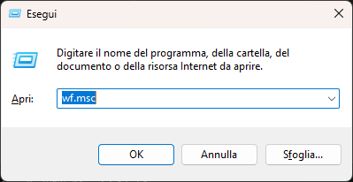
2. Nel pannello di sinistra clicca su **Regole connessioni in entrata**.

   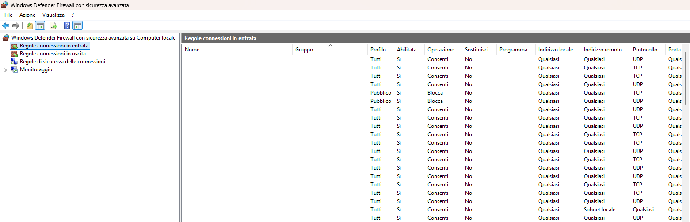
3. Nel pannello di destra clicca su **Nuova regola...**.

   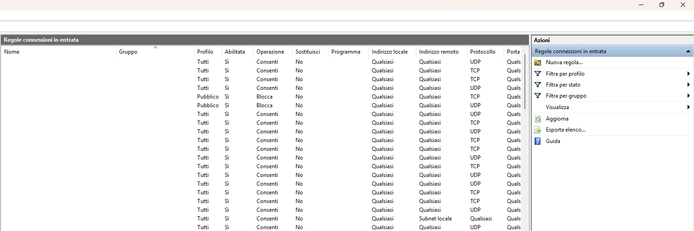
4. Nella finestra che si apre seleziona **Personalizzata** e clicca Avanti. La modalità personalizzata consente di configurare anche protocollo e ambito.

   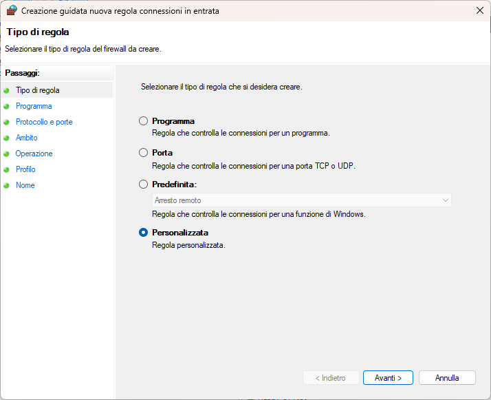
5. Seleziona **Questo percorso del programma** e, con **Sfoglia**, individua l'eseguibile del gioco, ad esempio `EliteDangerous64.exe`. Clicca Avanti.

   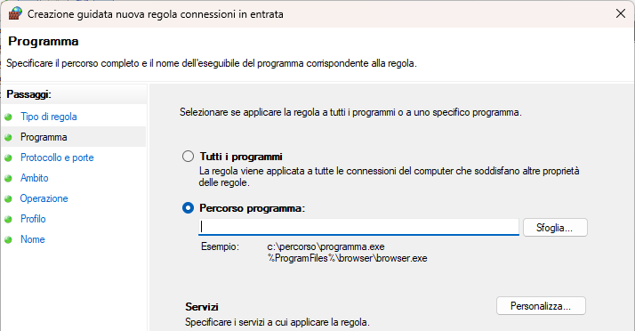
6. Nella schermata **Protocollo e porte**, imposta il tipo di protocollo su **TCP**. Clicca Avanti.

   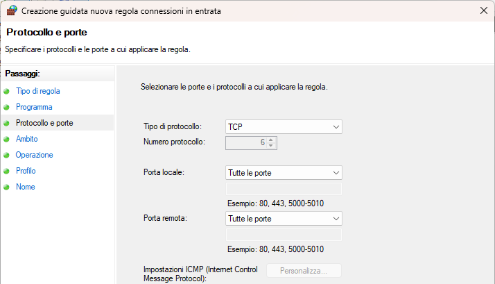
7. Nella schermata **Ambito**, lascia le impostazioni predefinite su **Qualsiasi indirizzo IP**, sia per gli indirizzi locali sia per quelli remoti. Clicca Avanti.

   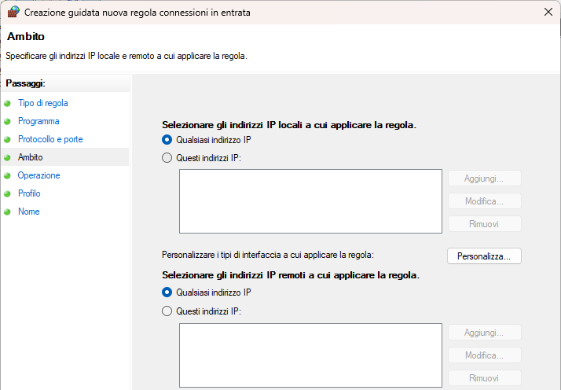
8. Nella schermata **Azione**, seleziona **Consenti la connessione**. Clicca Avanti.

   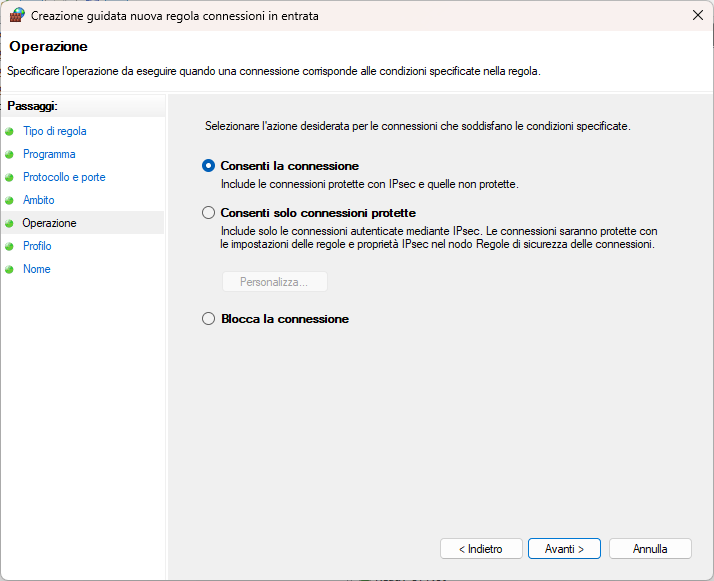
9. Nella schermata **Profilo**, lascia spuntate tutte e tre le caselle: **Dominio, Privato e Pubblico**. Clicca Avanti.

   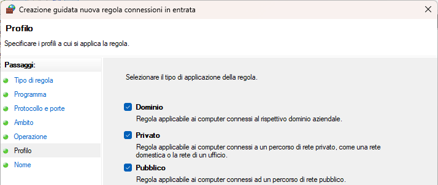
10. Dai alla regola un nome chiaro, ad esempio **Elite Dangerous: Odyssey executable**, e clicca **Fine**.

    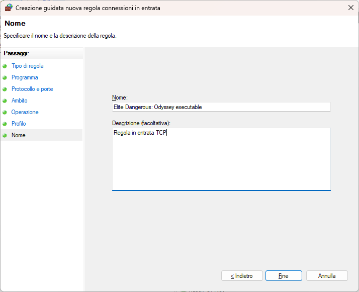
    
#### Ora crea la seconda regola per il protocollo UDP, senza ripetere tutta la procedura da capo:

12. In **Regole connessioni in entrata**, individua la regola appena creata, fai clic destro su di essa e seleziona **Copia**.
    
    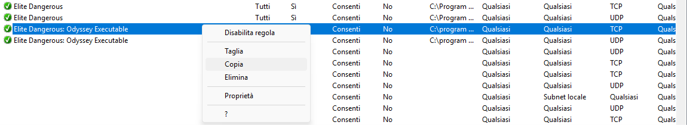
13. Vai quindi nel pannello di destra e clicca su **Incolla**. Windows creerà una copia della regola.

    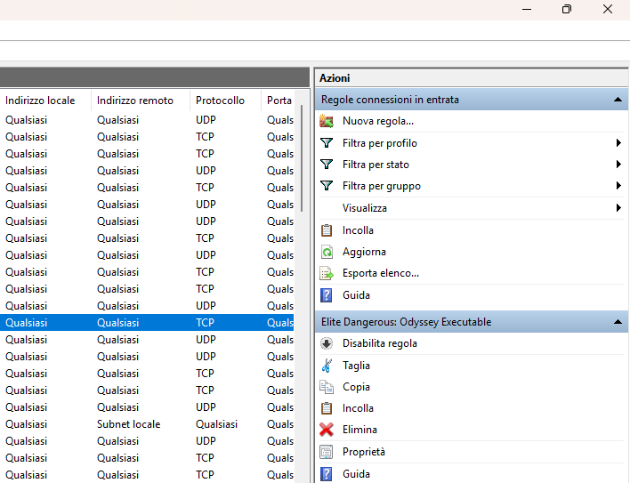
14. Fai clic destro sulla copia e seleziona **Proprietà**.

    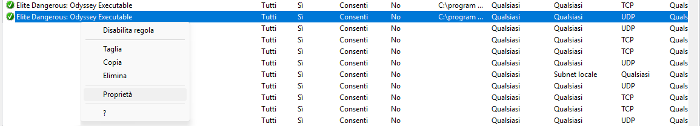
15. Apri la scheda **Protocolli e porte** e modifica **Tipo di protocollo** da **TCP** a **UDP**. Lascia invariati gli altri parametri.

    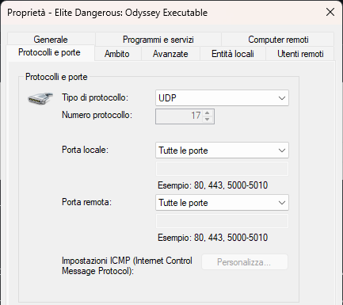
16. Apri la scheda **Generale** e rinomina la regola, ad esempio, in **Elite Dangerous: Odyssey executable**. Clicca **OK**.

    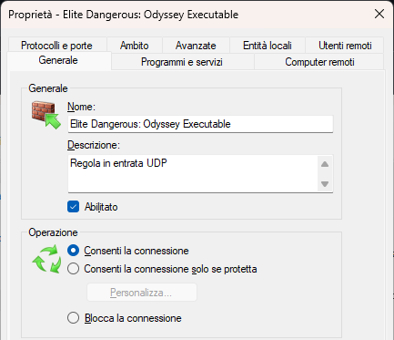
    
A questo punto dovresti avere due regole in entrata attive per l'eseguibile del gioco: una per TCP e una per UDP.

*Nota: se hai sia la versione base che quella Odyssey installate come eseguibili separati, ripeti la procedura per ogni `.exe` utilizzato effettivamente per giocare.*
___
### E la regola in uscita (outbound)?
___
Nella grande maggioranza dei casi non è necessaria: Windows, per impostazione predefinita, lascia passare il traffico in uscita a meno che tu non abbia configurato impostazioni di sicurezza particolarmente restrittive.
Se però vuoi essere sicuro al 100%, puoi ripetere la stessa procedura partendo da **Regole connessioni in uscita** invece che da Regole connessioni in entrata, usando lo stesso eseguibile, il protocollo Qualsiasi,
qualsiasi indirizzo IP, l'azione Consenti la connessione e tutti i profili.
___
### Verifica che tutto funzioni
___
Prima di lanciare il gioco, controlla che la configurazione sia a posto:

1. Torna su **Regole connessioni in entrata** in `wf.msc` e cerca la regola che hai appena creato: deve essere attiva.
2. Chiudi completamente Elite Dangerous (e il launcher, per sicurezza) e riaprilo da zero.
3. Entra in gioco e prova a inviare un invito al team a un amico, oppure fatti invitare tu.
4. Prova anche a inviare o ricevere un invito alla crew/multicrew, se vuoi verificare entrambe le funzioni.

L'invito dovrebbe rimanere visibile e permetterti di accettare l'invito, formare il team o unirti alla crew normalmente.

Se il problema persiste, controlla anche che non ci sia un firewall o antivirus di terze parti, diverso da Windows Defender, che sta bloccando ulteriormente il traffico.
In quel caso dovrai creare una regola simile anche in quel software.
___
### In sintesi
___
Il punto chiave è questo: creando manualmente una regola firewall puntata sull'eseguibile del gioco, e non sul launcher, elimini alla radice il problema delle regole automatiche di Windows,
che spesso vengono generate solo per il launcher o non vengono create per niente. La regola Inbound consente al gioco di ricevere il traffico P2P necessario per le funzioni online collegate a team,
crew/multicrew e instancing. Buon volo, CMDR, e ci vediamo nello spazio in compagnia!
